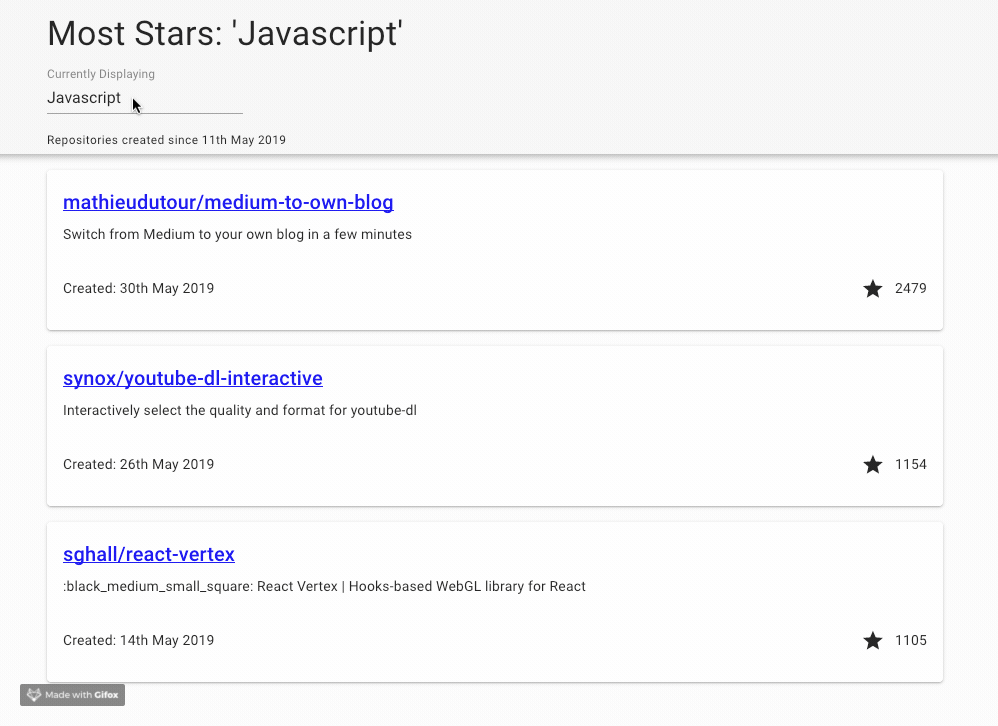

[](https://travis-ci.org/80sgreek/react-github-most-stars)
[](https://coveralls.io/github/80sgreek/react-github-most-stars)

# GitHub Most Stars



This project is an application built using TypeScript, React, Redux and Material UI to show the three most starred GitHub repositories for a given language in the last month. This application accesses Github's search API to retrieve JSON data. 

> NOTE: GitHub's search API is rate limited so sometimes 403 reponses can occur which result in no repositories being listed.

## Get Started

In order to start this project off you will need to have [node](https://nodejs.org/en/download/) and [yarn](https://yarnpkg.com/lang/en/docs/install/) installed.

### Installing
In the project directory, run the command `yarn install`. This will tell yarn to install all ofthe dependencies needed for this application.

### Running the application

In the project directory, run the command `yarn start`. This runs the application in development mode.

> NOTE: This takes a surprisingly long time so don't be surprised if it isn't instant.

Once this is running you can navigate to [http://localhost:3000](http://localhost:3000) to view it in the browser.

### Running unit tests

This project uses **jest** to handle unit tests. These can be run using the command `yarn test`. This runs the test in watch mode allowing you to see watch changes cause your tests to fail.

## Javascript Technologies Used

In this project I have used the following technologies:

| Technology  | Description |
|---          |---                                                         |
| Typescript  | Typed superset of Javascript                               |
| React       | UI framework                                               |
| Redux       | State management                                           |
| Material UI | React components Baed on Google's Material design language |

I have also used utilities as as:

| Technology | Description               |
|---         |---                        |
| Axios      | Promise based HTTP client |
| Moment     | Date helper               |
| Jest       | Testing Library           |
| SASS       | CSS compiler              |

This project was bootstrapped using Facebook's [create-react-app](https://github.com/facebook/create-react-app) repository.

## Why use that? Why do it that way?

Here is an explanation of why I made certain choices in this project.

### Redux

This, I've been told(read) is a great partner to React. As the React components share state it seems like a good idea to use a state management framework form the beginning.

### Material UI

I wanted to use a thrid party react component library so that I could create my applications UI as quickly as possible and gain experience of pulling in third party components. Using Material UI gave me a lot of common elements out of the box without needing to spend time building common UI elements such as input boxes, headers and cards.

### Typescript

After using Typescript recently I'm sold on the advantages of optional typing in JavaScript. The code completion allows you to move a lot faster and the need for breakpoints or `console.log` has greatly decreased as these kinds of issues are found at compile time.

### CSS Selector / SASS / Specificity

I added SASS out of habit but then didn't really need to use it. The autoprefixer that is bundled with the CRA (create-react-app) handled browser specific code and MAterial-UI took a lot of the weight out of building the layout. The one situation where I could have used SASS more I intentionally avoided, this was to wrap selectors within other selectors. The reason for this is due to experiences where the compiled CSS starts to become bloated due to unfortunate interactions with imports that has made me stay clear of this. I need to create an example to illustrate the point.

The specificity issue I mention in the title is this:

```SASS
/*
* RepositoryCard.scss
*/

.c-repositoryCard .c-repositoryCard-description { 
    /* I didn't want to add parent selector but specificity needed to increase to override material-ui */
    margin-bottom: 2rem;
}
```

Material UI is included as the last CSS file and so takes priority over all other previously defined rules. As a result I needed to increase the specificty of this rule to override it. It feels like a code smell as the intention everywhere elseis to limit the specificity. Maybe in the future I could add a mixin that added/removed Material UI overrides but for now I have done this.

### Moment.js

As soon as I saw the need to work with dates I decided to steer clear and move straight to moment.js to avoid the inevitable problems that occur with JavaScript dates.

### Axios

I decided to move to a promise based HTTP client to avoid reinventing the wheel. This was not a necessity but I found it nicer to use as any issues were wrapped away and hidden for me.

## Where next?

- ~~Setup continuous Integration with [Travis](https://travis-ci.org)~~ (...or just do this as it doesn't take long)
- ~~Code Coverage with [coveralls](https://coveralls.io/)~~ another quick addition
- E2E Testing with Jest + [Puppeteer](https://github.com/GoogleChrome/puppeteer)
- Serverside Rendering with... I need to investigate this 🤷
- Acessibility (need to check this UI is accessible using screen readers and make necessary changes if not)
- Prepare structure for SASS/CSS to allow for variables, mixins and utility classes to be added in the future
